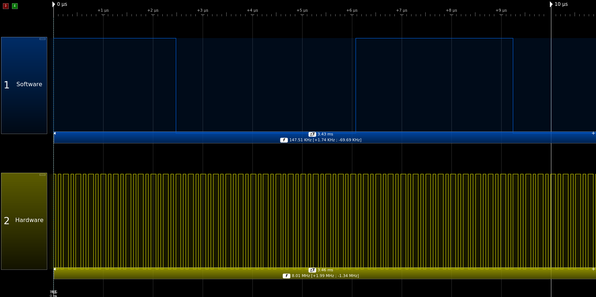
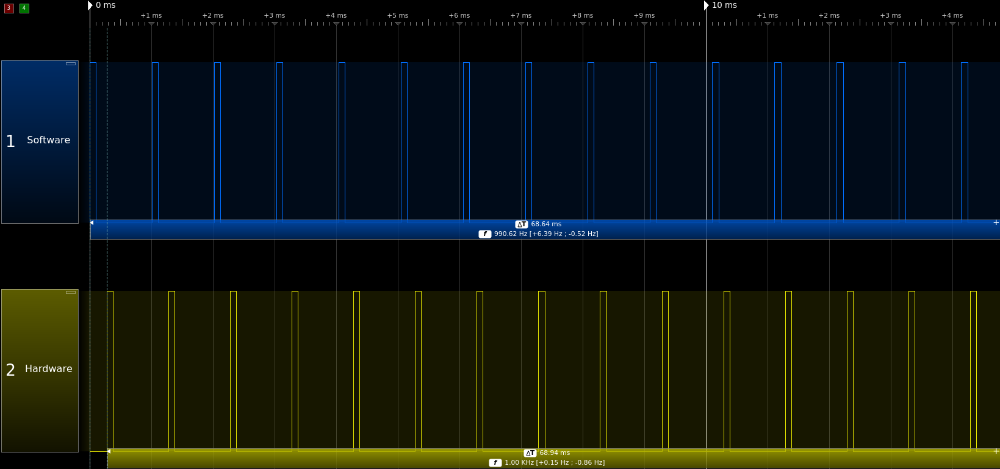
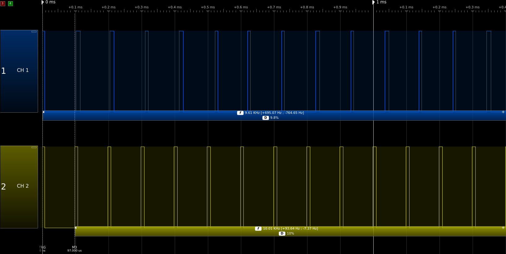
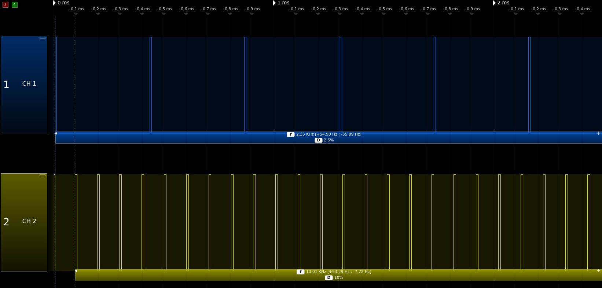
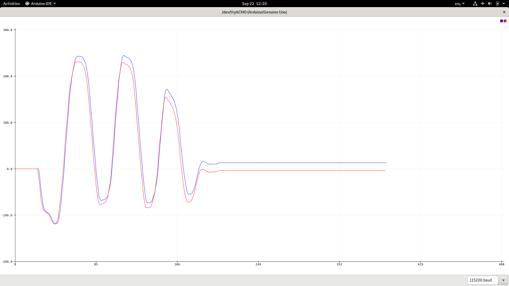

Ce document présente les résultats des deux codes d'exemples SignalGeneration et EncoderReading. Il s'agit de couvrir
deux fonctionnalités "avancées" d'un microcontroleur:

 - les timers pour la génération d'un signal PWM.
 - les interruptions pour la lecture de codeurs.


# Génération de signal PWM avec l'Arduino

Le premier exemple, SignalGeneration, montre comment générer proprement un signal PWM haute fréquence, par exemple
pour le controle de moteur, et explique l'intéret d'utiliser un hardware PWM. Je vous réfère au code pour plus de détails
concernant cette fonction: l'idée est de comparer le résultat des deux méthodes:

 - Hardware PWM (en jaune), qui se base sur l'horloge (et le système de TIMER) interne, pour générer un signal
 **sans faire aucun calcul: le cout en temps processeur est parfaitement nul**.
 - L'implémentation naive, en utilisant le language Arduino haut niveau pour générer depuis le logiciel du PWM, ce qu'on
 appelle software PWM.
 
 Le software PWM est infiniment moins performant et pratique que le hardware PWM. Pour commencer, il dépend entièrement
 de la capacité de calcul du processeur: si le code qu'on fait tourner prend trop de temps, le signal de sortie ne 
 sera pas le bon. Et surtout, il est beaucoup plus lent. Imaginons le code suivant visant à générer le signal le plus
 rapide possible:
 
 ```c++
void loop() 
{
  digitalWrite(8, HIGH);
  digitalWrite(8, LOW);
}
```
Le résultat est donné ci-dessous: en bleu le software PWM, en jaune le hardware PWM à la fréquence maximale:\


Ici, 100% du temps processeur est passé dans la fonction ```digitalWrite``` - et pourtant, on met quand même 3.2us pour
changer l'état de la broche: à l'inverse, le hardware PWM le fait à la moitié de la fréquence d'horloge, 16MHz, c'est à
dire en seulement 50ns ! Au final, le software PWM génère un signal à 147kHz seulement, 
**le hardware PWM est donc 55 fois plus rapide !** A noter de plus qu'il prend 0% du temps processuer, contre 100% pour
l'autre approche.

*Note: le signal du hardware PWM semble ne pas être monocromatique: même s'il reste périodique, il n'est pas "régulier".
Il s'agit en fait d'un phénomène d'aliasing, lié au fait que l'aquisition est faite à 20MHz, qui n'est pas un multiple
entier de la fréquence d'horloge de l'arduino, 16Mhz.* 


Prenons un cas plus raisonnable, où l'on cherche à générer un signal périodique à 1kHz, avec un duty cycle de 10%: ceci
est obtenu (en théorie) par le code suivant:

 ```c++
void loop() 
{
  digitalWrite(8, HIGH);
  delayMicroseconds(100);
  digitalWrite(8, LOW);
  delayMicroseconds(900);
}
```

Comme on peut le voir ci-dessous, ce code ne donne pas exactement la bonne fréquence: même si le signal a une bonne
tête, il est en fait à 990Hz, contre exactement 1kHz pour le Hardware PWM.\


On pouvait s'attendre à cette déviation, vu qu'on a vu plus tôt que ```digitalWrite``` prenait environ 3.25us - ce qui
rajoute 6.5us dans la boucle, proche du retard de 1% observé. Le code suivant permet d'obtenir de meilleur résultats,
au prix d'une charge processeur plus élevée: 

 ```c++
void loop() 
{
  unsigned long start = micros();
  digitalWrite(8, HIGH);
  delayMicroseconds(100 - (micros() - start));
  digitalWrite(8, LOW);
  delayMicroseconds(1000 - (micros() - start));
  }
```

Mais même ce code ne suffit plus quand on monte en fréquence: à 10kHz, on observer une erreur de 4% sur la fréquence,
et une erreur relative de 2% sur le duty cycle demandé.\


Enfin, il faut noter que pour le moment, l'Arduino n'exécutait aucun autre code. Si par exemple on voulait renvoyer des
donnés a l'ordinateur via la liaison série à 115200baud, on aurait vite un problème - puisque l'envoi d'un seul octet 
prend déjà 70us: impossible donc d'envoyer par exemple la position du codeur sur deux octets, cf. image ci-dessous où la
fréquence passe de 10kHz à 2.5kHz !


De manière plus générale bien sur - et c'est le plus important - ce code est ingérable si je veux vraiment faire faire
des choses à l'Arduino. Là j'avais un duty cycle de 10%, mais en pratique il va varier: impossible de savoir à l'avance
donc quand est-ce que j'aurais le temps dans le code pour faire autre chose (est-ce pendant la phase HIGH ou la phase 
LOW ? ). Donc à part un code très basique, et une très basse fréquence, pour que le code s'exécute beaucoup plus vite 
que le signal (par exemple un signal à 1kHz avec un code qui met 50us à s'exécuter), sinon il est impossible de générer
en Software PWM un signal qui resemble à quelque chose avec du code qui tourne...

# Lecture d'un encoder

Dans cette deuxième partie, je présente de même deux méthodes différents pour lire un encodeur : la manière propre, avec
des interruptions, qui peut être vue comme de la lecture "hardware" (même si cette fois ls temps processeur n'est pas
exactement nul), et la lecture "software", naïve, qui consiste à faire une lecture en boucle.

Le problème de la lecture en boucle, c'est qu'elle a de très grandes chances de rater des impulsions - d'autant plus 
élevées que le codeur tourne vite, et que l'Arduino fait d'autres choses en parralèle. Par exemple avec Gertrude, 
les codeurs généraient une interruption toutes les 20us - et on a bien vu dans l'exemple de génération de signal
que cette période n'est pas compatible avec le code usuel, par exemple avec la liaison série.

Dans l'exemple ci-dessous, j'ai pris le codeur VEX, d'assez basse résolution: 360 impulsions par tour. La lecture est faite
avec les deux approches, et les résultats sont renvoyés par port série au PC. In the curve below, the blue curve represents
the interrupt implementation, the red one the software version.\


Remarquez qu'au fur et à mesure du mouvement, les deux courbes se décalent: à la fin, il y a une vingtaine de pas d'écart
entre les deux valeurs: sur ce codeur, cela correspond quand même à une erreur de 18 degrés ! De plus, lors de ce
mouvement, il y a eu environ 2000 interruptions en une seconde: on est très très loin des 50000 qu'on pourrait voir
sur Gertrude. Je vous laisse imaginer la dégradation de performances alors que le nombre d'interruptions se multiplie...

# Conclusion

S'il y a une chose à retenir de ce document, c'est d'éviter deux écueils: chercher à générer un signal haute fréquence,
et à interpecter des variations rapides d'une entrée digitale pour compter les pas d'un codeur avec du "bête" code dans
une boucle while (ou le loop d'Arduino). Ces méthodes sont au mieux inefficaces (pour la génération de signal), voir
carrément erronés (cf. comptage des pas et le fait qu'on rate pas mal d'évènements).

L'utilisation des timers permet une génération très précise de certains signaux, mais avec pas mal de contraintes sur
le nombre de ports disponibles et leur usage simulannée. Le système d'interruption est indispensable pour capturer un
évènement - si toutes les broches de l'Arduino peuvent générer une interruption, toutes ne peuvent pas le faire en
même temps.

En ouverture, on peut noter qu'il existe, en plus des interruptions basés sur les évènements extérieurs (i.e. l'état
des GPIO), la possibilité de générer des interruptions en fonction de l'horloge. Ceci peut être utilisé pour générer
assez proprement un signal, sur tout les GPIOs du coup ! C'est comme cela que fonctionne la bibliothèque "Servo" par 
exemple: les premières versions utilisaient le hardware PWM sur les broches 9 et 10, mais désormais c'est TIMER1 qui est
utilisé, sans aucune contrainte donc sur la broche à utiliser. Contrairement au hardware PWM, elle utilise quand même
du temps processeur par la génération d'interruptions - mais permet quand même de génére proprement un signal type
servo RC, où une résolution de l'ordre de 5-10us est nécessaire. Cette fonctionnalité pourrait être adaptée pour controler
un moteur avec un signal PWM donc, si l'on veut en controler plus que ce que les timers nous permettent nativement.
